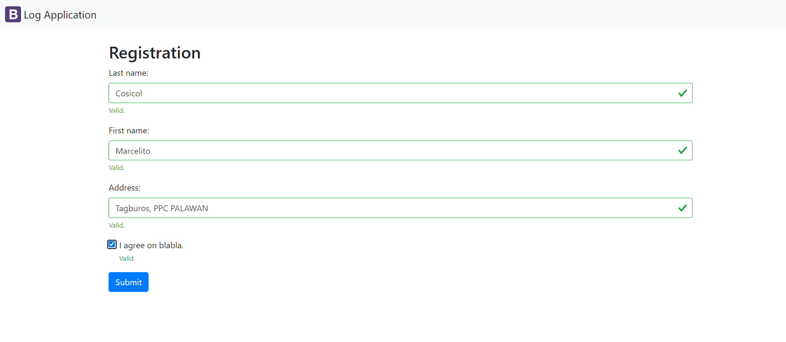

# Digital Logbook

A simple logbook web application that saves user information.

## WebApp Sample Picture

## Installation

    1. Create your database schema
       CREATE SCHEMA mydb;
       database schema : mydb
    2. Add admin table
        Column names
            1. id
            2. username
            3. password

    3. Add person table
        Column names
            1. id
            2. lastname
            3. firstname
            4. address
            5. logindt

    4. Go to your project folder and setup database connection

        Create config.php and copy this code
            <?php
            define('ROOT_URL', 'Change to your root url');
            define('DB_HOST', 'localhost);
            define('DB_USER', 'Your Database username');
            define('DB_PASS', 'Your Database password');
            define('DB_NAME', 'Your Database name');

        Create db.php and copy this code
            <?php
            // Create Connection
            $conn = mysqli_connect(DB_HOST, DB_USER, DB_PASS, DB_NAME);

            // Check Connection
            if(mysqli_connect_errno()){
                // Connection Failed
                echo 'Failed to connect to MySQL '. mysqli_connect_errno();
            }

## Author

### COSICOL, MARCELITO JR. A

### BSCS3-B1
